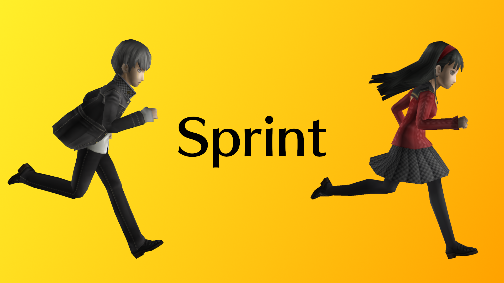

# p4g64.sprint

Also available on [GameBanana](https://gamebanana.com/mods/702062)!

A mod for Persona 4 Golden PC (64 Bit version) that adds a sprint button to the game.

## Usage
By default you hold the Circle/B button (or C key on PC) to sprint, and you go 1.3x faster than normal. You can change this behaviour in the mod's configuration menu in Reloaded.

This uses [Input Library 64](https://github.com/seyleonhart/p4g64.InputLibrary64) to handle the inputs so this mod has the same limitations as that. Mainly that you are limited to the keys that the game already uses. This does mean that by default when you are in dungeons the sprint button is the same as the one to re-center the camera. That's the only button that really makes sense though so you'll have to live with that for now.